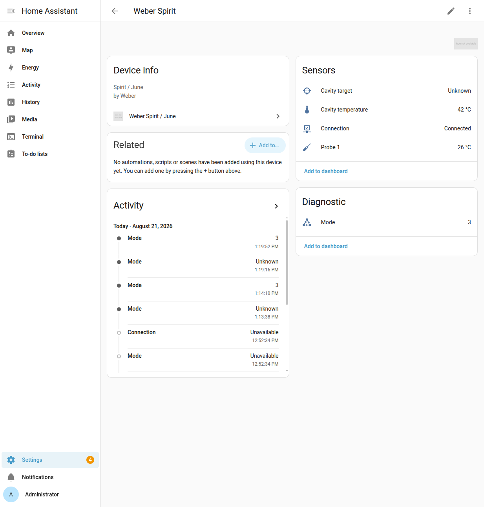
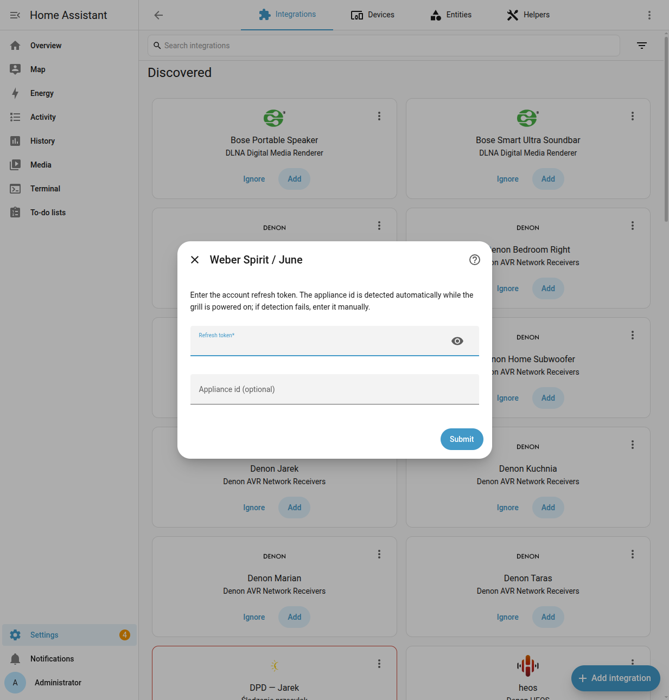

# Weber Spirit / June — Home Assistant integration

Read the live state of a WiFi-connected **Weber Spirit / June** grill in Home
Assistant, **straight from the cloud, with no companion app or Android VM running**.

The grill talks to `walker-cloud.com` over its own WiFi. This integration reuses
the same cloud API the official *Weber Connect* app uses — reverse-engineered and
reimplemented with **zero external dependencies** (Python stdlib only).

## Screenshots

| Device & entities | Setup |
|---|---|
|  |  |

## Entities

| Entity | Source |
|---|---|
| Cavity temperature | cook-history REST |
| Cavity target (setpoint) | companion WebSocket |
| Probe temperature(s) | cook-history REST / WebSocket |
| Connection | messaging `/status` |
| Mode | companion WebSocket (raw) |

## What it is — and isn't

- ✅ **App-free**: mints its own access token from a long-lived refresh token and
  reads temperatures + setpoint directly from the cloud.
- ⚠️ **Read-only**: it reads the grill's state; it cannot *set* the target from HA
  (the command channel is not implemented). Use an `input_number` + an automation
  if you want an HA-owned target/alarm.
- ⚠️ **Probe target is not on the cloud** — the cloud carries the probe
  *temperature* but not its setpoint, so there is no probe-target entity.
- ⚠️ **One session per account**: the live stream is a single connection, so this
  integration and the official app **cannot both run** at the same time. Use one
  or the other.

## Configuration

### OAuth client credentials (one-time, per install)

The OAuth *client* credentials (the same for every user, embedded in the Weber
Connect APK) are **not shipped in this repo**. Provide them once via the
environment of the process running Home Assistant, either way:

- **Environment variables** — `WEBER_CLIENT_ID` and `WEBER_CLIENT_SECRET`
  (Container/Supervised: `-e …`; Core venv/systemd: `Environment=` / `export`).
- **File fallback (HAOS)** — HAOS does not let you set env on the core process, so
  drop a `weber_june.env` in your HA config directory instead:

  ```
  WEBER_CLIENT_ID=...
  WEBER_CLIENT_SECRET=...
  ```

Extract the two values from a Weber Connect APK
(`com.weber.config.WalkerProdConfig`). See [.env.example](.env.example).

### Account

The only per-user secret is your account **refresh token**. The appliance id is
detected automatically while the grill is powered on (or you can type it in).

### Getting the refresh token

The token lives in the Weber Connect app's SQLite database on a device where you
are logged in:

```
com.weber.connect/databases/june_sdk.db   →   table session_info_table
  column: refresh_token   (value like "v2:...")
```

Read it with its `-wal` sidecar (a just-refreshed value lands there first). This
requires adb/root access to the device running the app — an advanced, one-time
step. The refresh token is long-lived and does not rotate, so once entered the
integration keeps minting access tokens on its own.

## Install (HACS)

1. HACS → Integrations → ⋮ → *Custom repositories* → add this repo (category:
   *Integration*).
2. Install **Weber Spirit / June**, restart Home Assistant.
3. *Settings → Devices & Services → Add Integration → Weber Spirit / June* and
   paste the refresh token.

## License

MIT — see [LICENSE](LICENSE).

> Not affiliated with or endorsed by Weber-Stephen Products LLC. "Weber" and
> "Spirit" are trademarks of their respective owners. Uses undocumented cloud
> endpoints that may change at any time.
